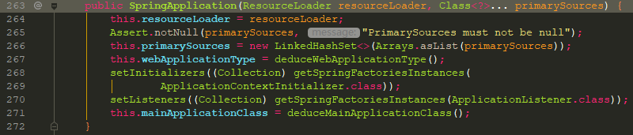

## 入口

SpringApplication.run(String... args)


### 加载Listener

  #### 调用关系树
  
  ```
  - getRunListeners
    - getSpringFactoriesInstances
      - SpringFactoriesLoader.loadFactoryNames 
        - loadFactoryNames
          - loadSpringFactories  
  ```          
  这里回去查找所有 jar 下面的 `META-INF/spring.factories` 文件
  
  #### spring.factories文件解读
  
             